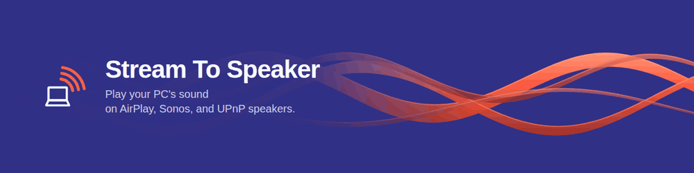

[](https://github.com/Mihonarium/StreamToSpeaker/actions/workflows/build.yml)
[](LICENSE)
[](LICENSE-BINARIES.md)

Stream To Speaker adds a virtual audio output to Windows and streams it over
the network — to Sonos, IKEA SYMFONISK, KEF, Denon HEOS, MoOde and Volumio
over **UPnP / OpenHome**, and to HomePod, AirPort Express and shairport-sync
over **AirPlay**. Windows volume and the speaker's own buttons stay in sync.

## Install

**[⬇ Download](https://github.com/Mihonarium/StreamToSpeaker/releases/latest/download/StreamToSpeakerSetup.exe)**
and run it. Needs Windows 10 1809+ / Windows 11, 64-bit (not Windows Server).

## Use

1. Set **Stream To Speaker** as the Windows audio output — or route a single
   app to it in the Volume Mixer.
2. Pick a speaker in the app.

Sonos speakers grouped in the Sonos app show up as one entry ("Living Room +
Kitchen"); audio plays on the whole group and the volume slider moves the
group volume. To stream to a single speaker, ungroup it in the Sonos app.

Sound lagging behind video → **−25 / −100 ms**. No sound → **Resync**
(`Ctrl+Shift+R`). Speaker missing → **↻ Rescan**; check it's on the same
network as the PC.

Closing the window minimises to the tray; quit from the tray menu.

## CLI flags

```
--headless                No GUI; run as a CLI service.
--no-tray                 GUI window only, no tray icon.
--web                     Enable the HTTP/JSON API + web UI. Off by default;
                          when off, only /stream.raw is served.

--source <auto|driver|wasapi-loopback|sine>
                          Audio input. Default 'auto': kernel driver, falling
                          back to WASAPI loopback.

--player <name-or-ip>     Speaker to use: name substring or IPv4. Omit to pick
                          in the GUI (or the terminal picker in --headless).
--no-interactive          Skip the terminal picker even in a TTY.
--list-speakers           Print discovered speakers and exit.
--no-discovery            Skip discovery; only serve HTTP.

--port <N>                TCP port. Default 5901.
--bind <ip>               HTTP bind address. Default 0.0.0.0.
--advertise-ip <ip>       IP to advertise in the stream URI sent to the
                          speaker. Default: first non-loopback IPv4.

--initial-buffer-ms <N>   Prebuffer hint sent to the speaker. Default 50.
--silence-pace-ms <N>     Pacing of silence packets. Default 10 (real-time);
                          higher drains the speaker's buffer between tracks.
--rate-fudge-ppm <N>      Clock-skew compensation. Default 0.
--latency-adjust-step-frames <N>
                          Frames added or dropped per packet while adjusting
                          latency. Default 4.
--no-silence-injection    Don't inject a low noise floor during silence.
--silence-packets-threshold <N>
                          Consecutive silent packets before quiescence.

--ssdp-interval <N>       Minutes between re-discoveries. Default 5.
--log-level <level>       error / warn / info / debug / trace. Default info.
```

Tuning the last group: [TECHNICAL.md](TECHNICAL.md#latency-control).

## Verifying a download

```
gh attestation verify StreamToSpeakerSetup.exe -R Mihonarium/StreamToSpeaker
```

proves the file was built by this repository's CI from a specific commit.
Offline: `--bundle <file>.sigstore.json`, shipped with each release.

## Developers

Architecture, building from source, HTTP API: [TECHNICAL.md](TECHNICAL.md).
Driver signing pipeline: [docs/driver-signing.md](docs/driver-signing.md).

## License

Source [MPL-2.0](LICENSE). Released binaries: free to install and use,
no redistribution or modification — [LICENSE-BINARIES.md](LICENSE-BINARIES.md).

Driver scaffold derives from Microsoft's sysvad sample (MIT); UPnP/SSDP
patterns from [swyh-rs](https://github.com/dheijl/swyh-rs) (MIT).
